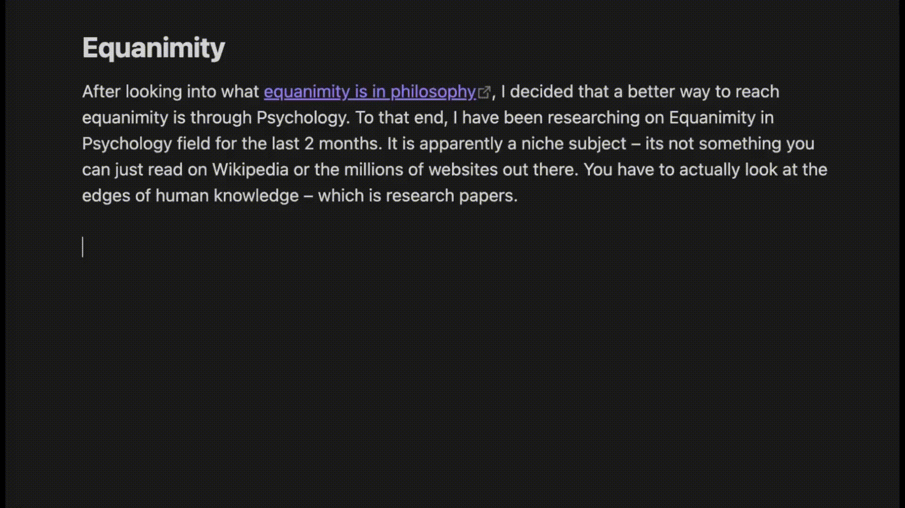

# Slasher Obsidian Plugin

Slasher lets you create custom editor commands that appear in Obsidian's command system, which also makes them available from Slash commands. Each command has a name and a template. Template string decides what actually shows up in the editor.

If you want to use this with the slash command, than the Slash Command core plugin needs to be turned ON. You can find that at Obsidian > Settings > Core Plugins > Slash Commands - turn this ON.

You can also [set custom keyboard shortcuts for your custom commands](https://obsidian.md/help/hotkeys).



## Template Syntax and Example Use Cases

Templates are freeform text. Mix plain text with dynamic tokens:

- Link to tomorrow's note: `[[{{ tomorrow | format: "yyyy-MM-dd" }}]]`
- Link to date picker note: `[[{{ date_picker | format: "yyyy-MM-dd" }}]]`
- Document last updated on: `Document Last Updated on {{ file_modification_date | format: "MMM do, yyyy" }}`
- Vault Notes Count: `find {{ vault_path }} -type f -name "*.md" | wc -l`
- Word count: `wc -w < {{file_path}}`
- Trimmed Clipboard: `{{ clipboard | replace_regex: "^\s+", "" | replace_regex: "\s+$", "" }}`
- Total Notes Count: `find {{ vault_path }} -type f -name "*.md" | wc -l`

## Supported Variables

### Date variables

- `{{ today }}`
- `{{ tomorrow }}`
- `{{ yesterday }}`
- `{{ file_creation_date }}`
- `{{ file_modification_date }}`

Date values must use the `format` filter before insertion:

```text
{{ today | format: "yyyy-MM-dd" }}
{{ tomorrow | format: "EEE" }}
{{ file_modification_date | format: "PPP" }}
```

Important: use `MM` for months. `mm` means minutes in date-fns. 

For more options, check the [date-fns format documentation](https://date-fns.org/docs/format).

### Clipboard variable

- `{{ clipboard }}`

Example:

```text
{{ clipboard | replace_first: "replace", "this" }}
{{ clipboard | replace: "foo", "bar" | replace: "baz", "qux" }}
{{ clipboard | replace_regex: "\d+", "#" }}
{{ clipboard | replace_first_regex: "foo\s+bar", "baz", "i" }}
```

### Vault and file variables

- `{{ file_path }}`
- `{{ file_name }}`
- `{{ file_stem }}`
- `{{ folder_path }}`
- `{{ vault_path }}`
- `{{ vault_name }}`

`{{ file_path }}` resolves to the note's absolute filesystem path. File-scoped variables require an active file. If no file is active, the command shows a Notice and inserts nothing.

### Shell command

- `...`

Example:

```text
ls -1 {{ vault_path }}
wc -w {{ file_path }}
```

Nested Liquid output tags inside the command body are resolved before the shell command runs. Inserted values are shell-escaped.

Shell commands are executed with:

- the user's shell from `process.env.SHELL`, or `/bin/bash` as a fallback
- `-lc`
- the vault path as the working directory

If the command exits with a non-zero status, the plugin shows a notice and inserts nothing.

### Date picker

- `{{ date_picker | format: "yyyy-MM-dd" }}`

Example:

```text
{{ date_picker | format: "yyyy-MM-dd" }}
```

When the command runs, the plugin opens a small date picker modal and inserts the chosen date using the provided format.

The legacy `` tag is still accepted for existing templates, but new templates should use the output syntax above.

### Supported Filters

#### `format`

Used with date-like values only:

```text
{{ today | format: "yyyy-MM-dd" }}
{{ file_creation_date | format: "PPP" }}
{{ date_picker | format: "EEE, MMM d" }}
```

#### `replace`

Replaces all literal matches in string values:

```text
{{ clipboard | replace: "from", "to" }}
```

#### `replace_first`

Replaces only the first literal match in string values:

```text
{{ clipboard | replace_first: "from", "to" }}
```

#### `replace_regex`

Replaces all regex matches in string values. The third argument is optional regex flags; `g` is applied automatically:

```text
{{ clipboard | replace_regex: "\d+", "#" }}
{{ clipboard | replace_regex: "foo\s+bar", "baz", "i" }}
```

#### `replace_first_regex`

Replaces only the first regex match in string values. The third argument is optional regex flags; any `g` flag is ignored:

```text
{{ clipboard | replace_first_regex: "\d+", "#" }}
{{ clipboard | replace_first_regex: "foo\s+bar", "baz", "i" }}
```

## Settings UI


All commands you have added are listed in the Settings page.

Each row also keeps an enabled toggle beside the command name, and the template cell includes an `⚙︎` button.

The `⚙︎` is just a template builder - you can use it to build the template you want without knowing the template format.
